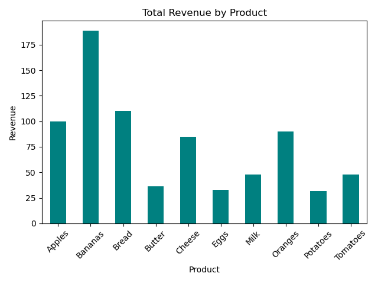
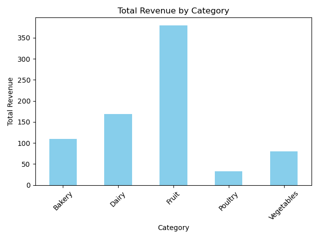
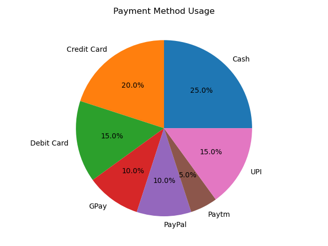
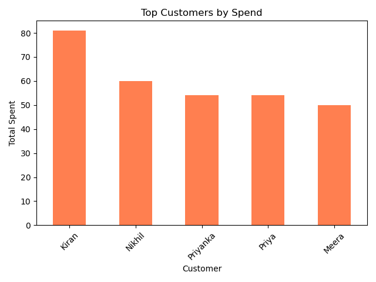
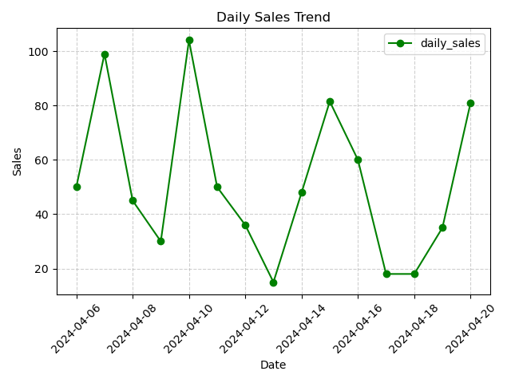

# Task_7
 Sales Summary from a Tiny SQLite Database using Python

 # 🧾 Sales Data Analysis Project

This project performs exploratory data analysis on grocery sales data stored in an SQLite database. The dataset tracks product sales, categories, customers, payment methods, and total revenue.

---

## 📊 Visual Reports

### 1️⃣ Total Revenue by Product
Displays which products generated the highest revenue.

---

### 2️⃣ Total Revenue by Category
Shows which product categories contribute most to the overall earnings.

---

### 3️⃣ Payment Method Usage
Pie chart of payment methods used by customers.

---

### 4️⃣ Top Customers by Spend
Bar chart of the top 5 highest spending customers.

---

### 5️⃣ Daily Sales Trend
Line chart visualizing daily sales growth and fluctuations.

---

### 🏆 Most Sold Product by Quantity
Printed in console:  
The single most sold product in terms of quantity.

---

## 💡 Technologies Used
- SQLite
- Python (Pandas, Matplotlib)

---

## 📦 How to Run
1. Clone this repository.
2. Make sure you have `sqlite3`, `pandas`, and `matplotlib` installed.
3. Run the Python script to generate all visuals and reports.

---

## 📌 Conclusion
This project shows how SQL and Python can be combined to:
- Query sales data.
- Create clear, business-friendly visualizations.
- Help decision-makers see trends in product sales, customer spending, and payment habits.

